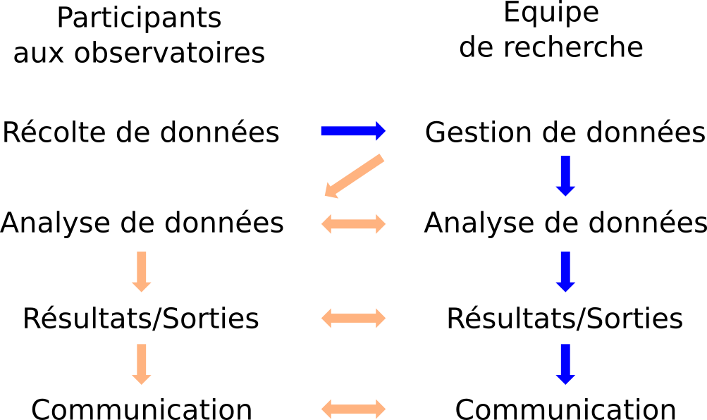
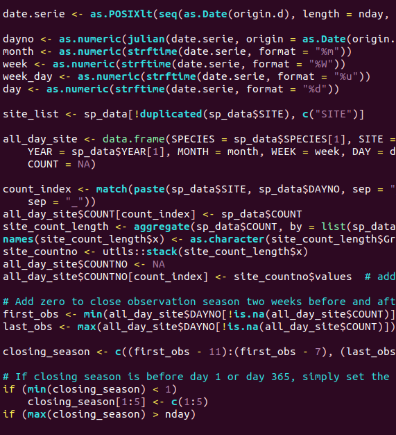
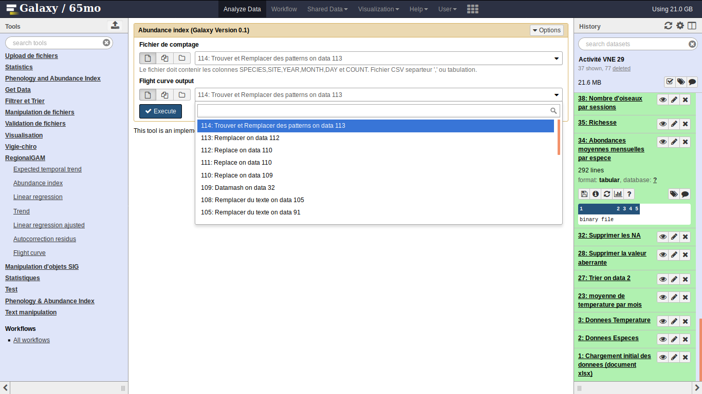

# Itinéraire historique des données issues des sciences participatives

**Récolte des données** > Gestion des données > Analyse des données > Résultats/Sorties > Communication
<!-- Les données sont récupérées sur le terrain puis saisies dans des bases de données. Elles sont analyses par des membres des laboratoires de recherche qui vont communiquer les résultats dans des revues scientifiques, via des restitutions --> 

# Proposition d'un nouvel itinéraire

# Objectifs

- Proposer de nouvelles voies pour la participation
- Maintenir la participation existante
- Donner aux participants les moyens de répondre aux questions qu'ils se posent

# Nécessité de concevoir des outils adaptés aux publics

# Besoin de formation

# Perspectives

- Analyse de donnée collaborative
    - Proposer des pistes pour l'exploration des données avec les participants qui contribuent directement à l'analyse
    

# Mise en conformité par rapport aux rêgles d'accès aux données
- Obligation réglementaire
- Très compliqué sans outils d'analyse

#

il faut impérativement disposer d'outils d'analyses pour pouvoir ne serait-ce que visualiser les données.
