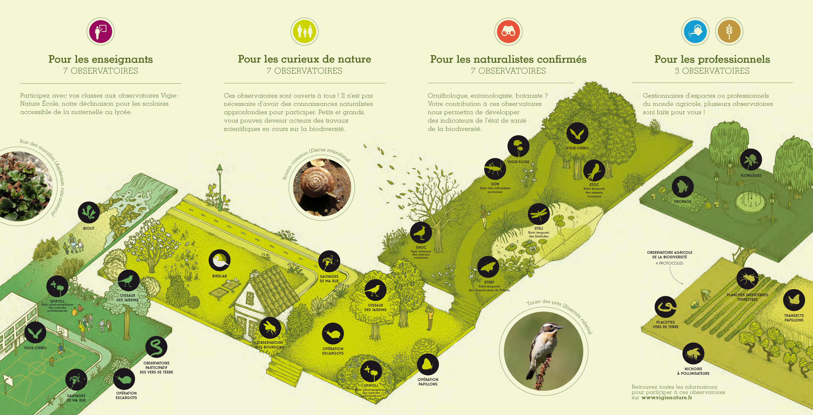
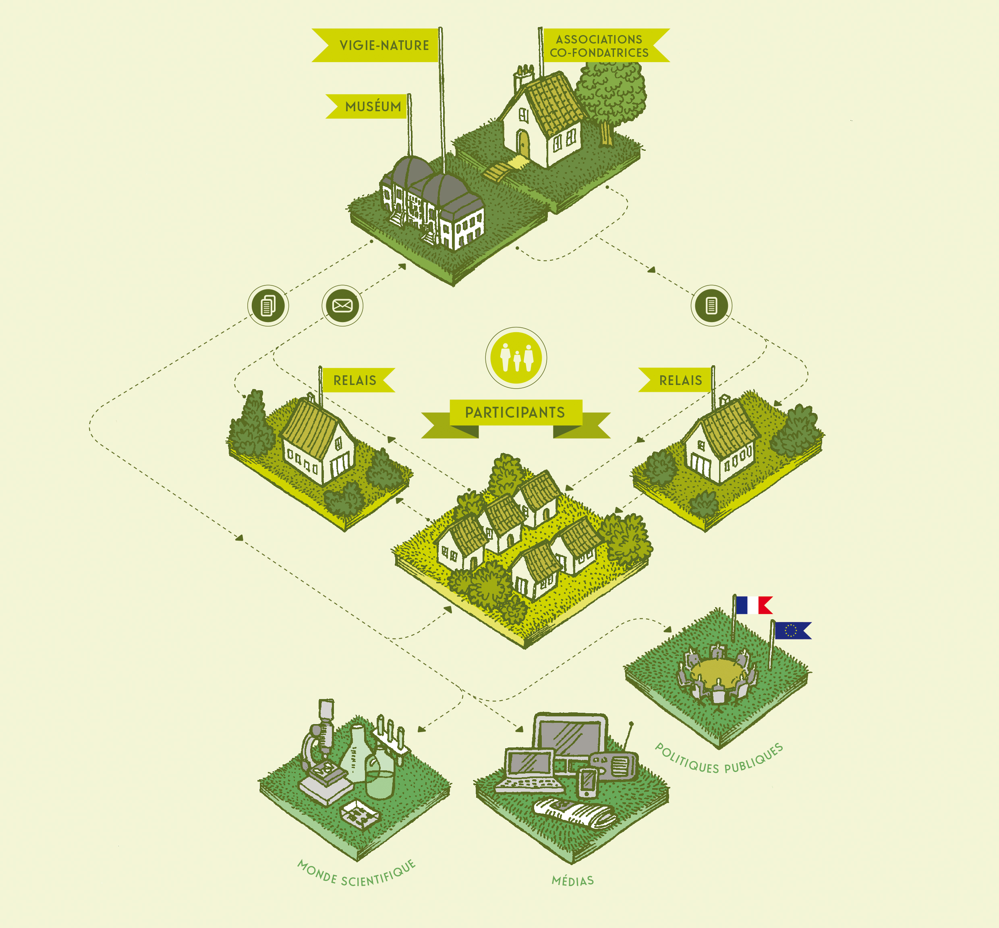

# Galaxy-Ecology : Une plateforme d'analyse de données accessible
Simon Bénateau, Benjamin Yguel, Alan Amossé, Yvan Le Bras

L'analyse des données issues des obervatoires de scicences participatives nécessite l'emploi d'outils statistiques pointus qui requièrent des compétences en programmation. Ces dernières peuvent représenter un obstacle à l'apprentissage ou à l'utilisation d'outils par certains acteurs de la communautés des sciences participatives.  
La plateforme galaxy-E permet de développer des outils avec une interface graphique, gérant les dépendances et la reproductibilité des analyses. Elle facilite l'accès à ces outils pour les acteurs des sciences participatives qui analysent les données et produisent des indicateurs.  
Nous vous présenterons les derniers développement des outils de la plateforme et sur les projets.  

# Vigie nature  

# Organisation du réseau d'acteurs

# La place de l'analyse de données et de la production d'indicateurs

# Demandes de la communautés et freins à l'implémentation

- Associations et structures partenaires
- Indicateurs régionnaux
    - Communication auprès des participants, des médias et des instances politiques
- Accès aux données
- Installation et utilisation des outils
    - Dépendances (e.g. versions des packages)
    - Lignes de commande (utilisation de R)

# Simplicité d'utilisation

- Interface web sans ligne de commande

# Possibilité de partage

- Jeux de données
-

# Perspective

FAIR

- Tutoriels
