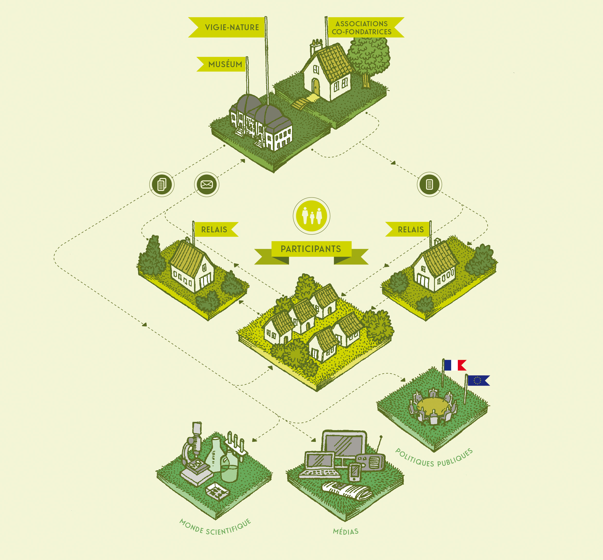
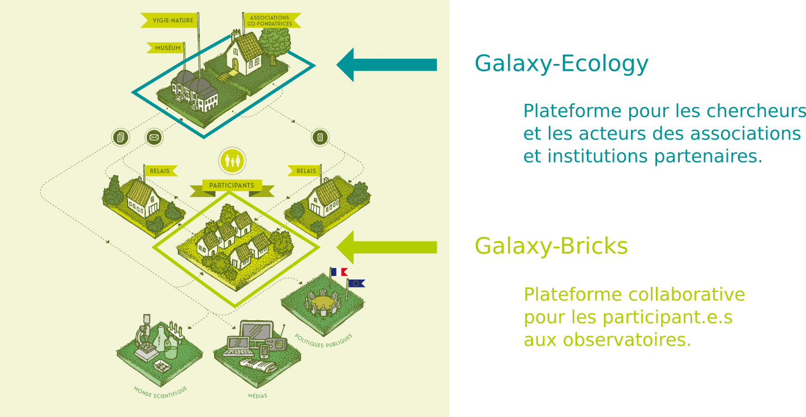
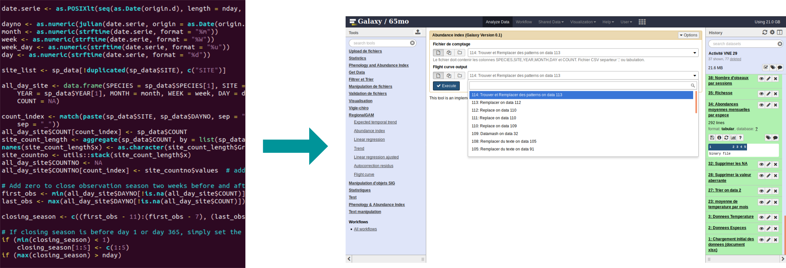
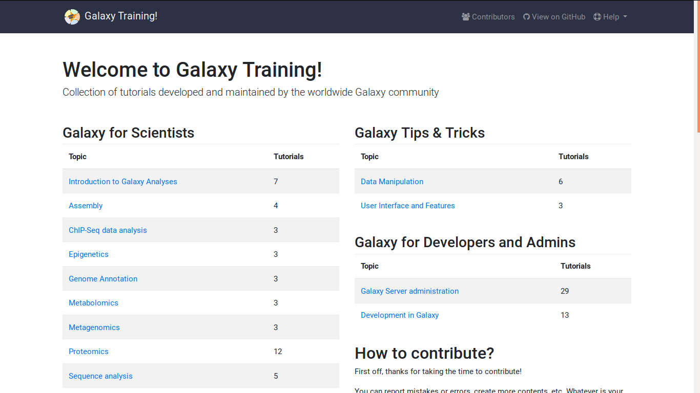

# Vigie nature  

# Organisation du réseau d'acteurs

# Destination des plateformes d'analyse de données

# Axes de développement et freins à l'implémentation

- Besoins principaux
    - Accès aux données
    - Indicateurs régionaux
    - Communication auprès des participants, des médias et des instances politiques
- Freins principaux
    - Formation à l'utilisation des méthodes
    - Installation et utilisation des outils
        - Dépendances (e.g. versions des packages)
        - Lignes de commande (utilisation de R)

# Accès aux données

- Outils dédiés
    - Importation des données des observatoires
    - Importation depuis des bases de données naturalistes
        - gbif, bison, inat, ebird, antweb, ala, idigbio, obis, ecoengine, vertnet
    - Importation de données écologiques
        - Worldclim
	      - Davantage de données bientôt
- Bibliothèques de données

# Outils

# Outils

- Calcul d'indicateurs
    - RegionalGAM (Suivi de l'abondance de papillon)
    - Tendances STOC-EPS (Suivi temporel des oiseaux communs)
- Traitement de données
    - Détection et identification de chauves-souris à partir de d'enregistrements
- SIG
    - GDAL

        - traitement de fichiers raster / vecteur

- Analyse de données
    - Détection et identification de chauves-souris à partir d'enregistrements
    - Calcul d'indicateurs
       - RegionalGAM (Suivi de l'abondance de papillon)
       - Tendances STOC-EPS (Suivi temporel des oiseaux communs - Point d'écoute)

# Outils

- Intégration d'outils shiny
    - Wallace (Modélisation de distribution d'espèces)
- Autres outils interactifs
    - Visualisation de données  

# Possibilité de partage

- Données
- Outils
- Workflow
- Résultats
- Rapports

# Tutoriels

# Perspectives

- Gain de temps pour la production des indicateurs
- Créer des ponts entre les développeurs et les utilisateurs des méthodes
- Améliorer le partage des données et des méthodes d'analyse
- Gérer certains aspects des soucis de reproductibilité
- Facilité le travail "interdiciplinaire"

# Merci

