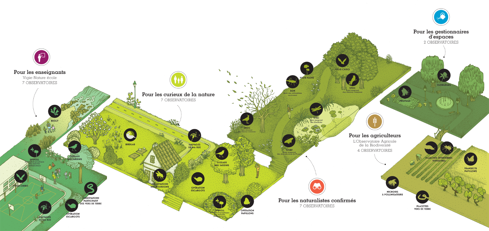

Ajouter Logo GAPARS / H2020
# Vigie nature  

- bulle -> clarifier -> regarder slide Karine

# Organisation du réseau d'acteurs

- clair sur les boites

# Destination des plateformes d'analyse de données

- Bien mais à voir pour clarifier

# Demandes des la communauté et freins à l'implémentation
- reformulation du titre

- Besoins principaux
    - Accès aux données
    - Accès outils d'analyse
        - Manipulation de fichiers
        - Analyses statistique
        - Visualisation)
    - Indicateurs régionaux (pour les gestionnaires)
    - Communication auprès des participants, des médias et des instances politiques
- Freins principaux
    - Formation au méthodes
    - Formation à l'utilisation des outils
    - Installation et utilisation des outils en autonomie
        - Dépendances (e.g. versions des packages)
        - Lignes de commande (utilisation de R)

# Accès aux données

- Outils dédiés
    - Importation des données des observatoires
    - Importation depuis des bases de données naturalistes
        - gbif, bison, inat, ebird, antweb, ala, idigbio, obis, ecoengine, vertnet
    - Importation de données environmentales, covariables
        - Worldclim
	      - Davantage de données bientôt
- Bibliothèques de données
- Import direct des données
    - URL
    - Fichiers locaux

# Outils

- Flécher input code vers outil voir dev galaxy
- ligne de commande R pour l'exemple

# Outils

- Manipulation de fichiers
    - tri / filtre / joiture de table
- SIG
    - GDAL
        - traitement de fichiers raster / vecteur

- Analyse de données
    - Détection et identification de chauves-souris à partir d'enregistrements
    - Calcul d'indicateurs
       - RegionalGAM (Suivi de l'abondance de papillon)
       - Tendances STOC-EPS (Suivi temporel des oiseaux communs)

# Outils
- Visualisation interactive
    - Librarie D3.JS (Histogramme, nuage de points...)
    - openlayers (Visualisation SIG)
- Autres outils interactifs
    - Jupyter notebook
    - Rstudio
- Intégration d'outils Shiny
    - Wallace (Modélisation de distribution d'espèces)

# Possibilité de partage

- Données
- Outils
- Workflow
- Résultats
- Rapports

# Tutoriels

# Perspectives

- Gain de temps pour la production des indicateurs
- Créer des ponts entre les développeurs et les utilisateurs des méthodes
- Améliorer le partage des données et des méthodes d'analyse
- Gérer certains aspects des soucis de reproductibilité
- Facilité le travail "interdiciplinaire"

# Merci

