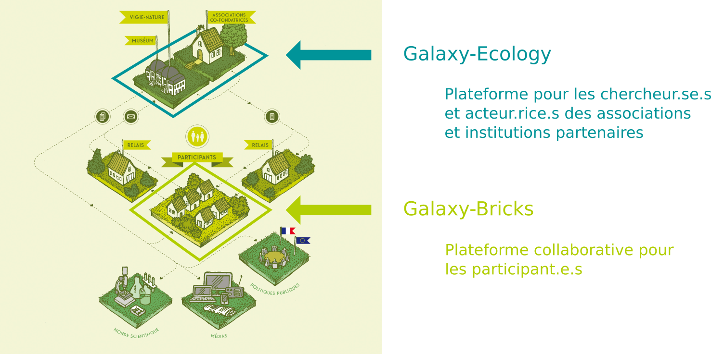
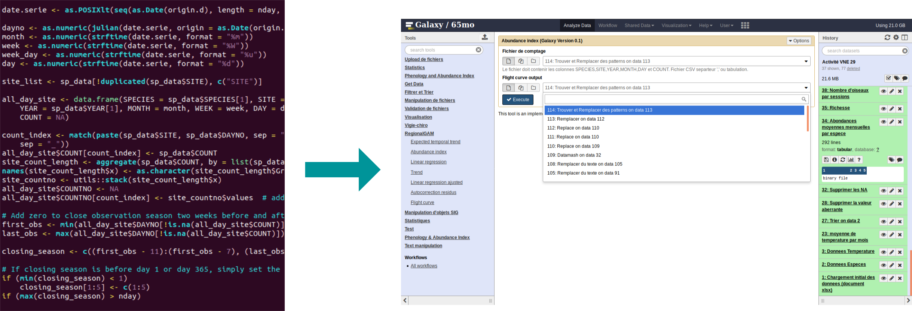

# Vigie nature  

- bulle -> clarifier -> regarder slide Karine

# Organisation du réseau d'acteurs

- clair sur les boites

# Destination des plateformes d'analyse de données

- Bien mais à voir pour clarifier

# Objectifs identifiés - "grand public"

- Proposer de nouvelles possibilités pour la participation citoyenne
- Donner un accès aux données et permettre leur exploitation
- Donner aux participants les moyens de répondre aux questions qu'ils se posent sur les données

# Objectifs identifiés - Vigie Nature Ecole

- Proposer un nouvel outil pour l'apprentissage de la démarche scientifque
- Formation à l'analyse de données
- Possibilité de proposer une approche interdiciplinaire

# Réflexion sur l'ergonomie

# Nécessité de formation
- Formation à l’outil via des tutoriels
- Formation à l’analyse de données écologiques contextualisée
- Création de supports interactifs

# Possibilité de partage

## Au sein de Galaxy
- Données
- Outils
- Workflow
- Résultats
- Rapports

## Plateforme d'échange

- Forum
- Chat

# Perspectives

- Analyse collaborative

# Merci

