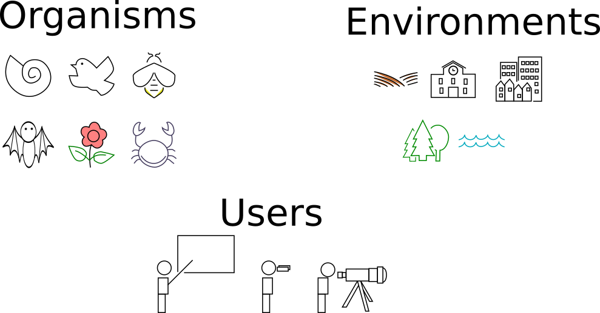
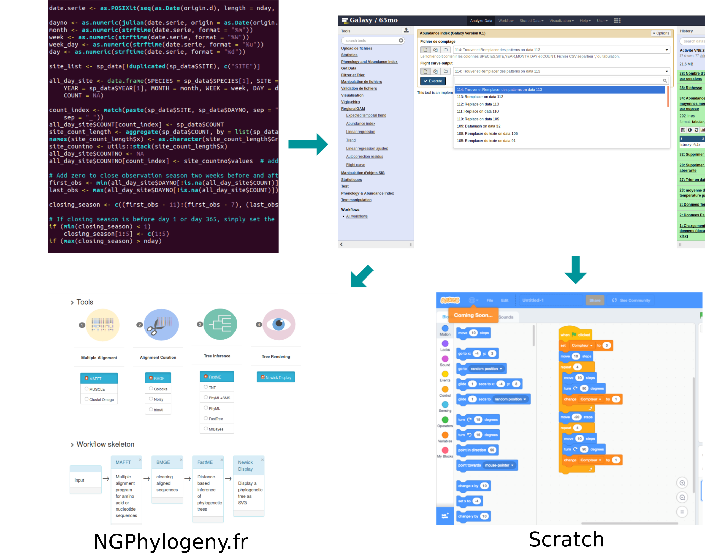

# Diversity of the Citizen science community  

# Citizen science Network

# Two platforms for the analysis

# Objectives - "Global"

- Propose new possibilities to participate for the citizens
- Give access to data and to data analysis tools
- Give to the participants a tool to answer the questions they have

# Objectives - High school students

- Give a new tool to for scientific approach education
- Data literacy education
- Increase interdisciplinary possibilities

# Why Galaxy

- Community
- Development and maintenance of tools
- FAIR
- Access to high performance computing

# Simplification of the user interface

# Perspectives

- Collaborative analysis

# Want to know more or collaborate

- Poster 45C
- CoFest project

# Thank you

\includegraphics[height=2.8cm]{figures/Team/Alan.jpg} \hfill \includegraphics[height=2.8cm]{figures/Team/Benjamin.jpg} \hfill \includegraphics[height=2.8cm]{figures/Team/Yvan.jpg} \hfill
\includegraphics[height=2.8cm]{figures/Team/Sebastien.jpg}
